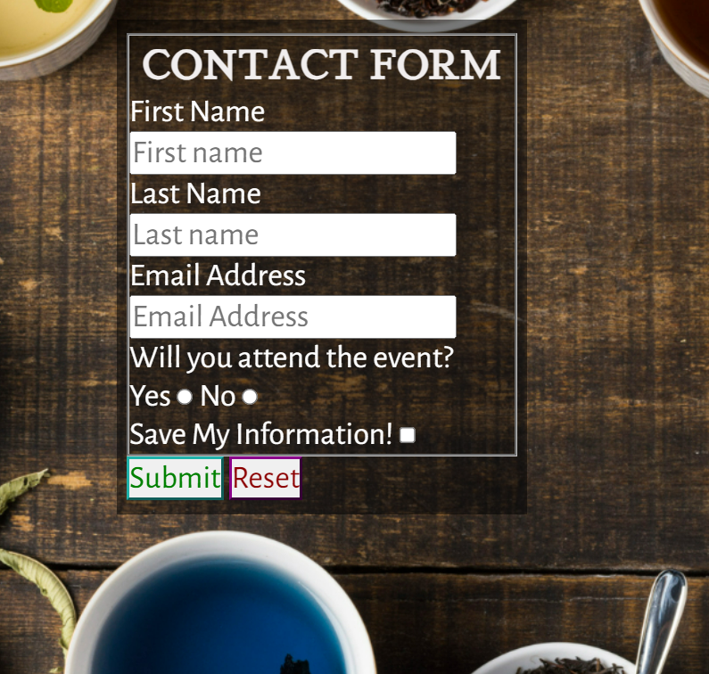

# Different Coloured Tea

Different Coloured Tea is a website to spread awareness to tea drinkers that only had black tea or black and green tea.
The visitor will find out that there is other tea than black and green tea also red (rooibos), white, yellow, blue and purple tea, I will also mention Oolong tea that is often a bit grayish brown with a hint of yellow often called in between black and green, the site does not plan to mention for example the huge quantity of tea from each colour or herbal tea, it will also include pictures of the different colours..

## Features 

### Existing Features

- __Navigation Bar__

  - The navigation bar can be found on all 3 pages and is fully responsive, it will turn between a bar or buttons depending on the size of the screen.
  - The bar will be visible even if you scroll down. 

- __The landing page images__

  - The landing page or "Home" has 8 different coloured tea on it, with 1-2 pictures in a row depending on screen size and it is fully responsive in image size also. 
  - This page will make the visitor see all kind of colours on tea that they might not know that it existed.

- __About Tea__

  - About Tea page will give a short description of the different coloured tea. 
  - I have put different coloured background behind every div related to a specific tea colour. 

- __Contact Us__

  - The Contact Us page has a contact form and a background picture that is fully responsive. 
  - The form has a background with an opacity to make it see through while still making the text easy to read. 

- __The Footer__ 

  - The footer section includes links to the relevant social media sites for Love Running. The links will open to a new tab to allow easy navigation for the user. 
  - The footer is valuable to the user as it encourages them to keep connected via social media

For some/all of your features, you may choose to reference the specific project files that implement them.

In addition, you may also use this section to discuss plans for additional features to be implemented in the future:

### Features Left to Implement

- I wanted to make an event information, also to get links from every picture on Home to the correct line in About Tea, make buttons change colour when marked, creating a couple of icons and maybe something more that I haven't thought about.

## Testing 

I have tested all links and buttons including navbar and they all work, the form also work and requires an email in email field, one of the radio buttons and the name fields filled in, but checkbox is optional.
I have tested on Chrome, Firefox and Edge without a problem, checked on many different sized from about 280p to 2000 px wide and 400px to about 2000 px high and didn't find any problems with the responsiveness.

### Validator Testing 

- HTML
  - No errors were returned when passing through the official [W3C validator](https://alexanderaberg.github.io/Different-Coloured-Tea/index.html) Also checked About Tea and Contact Us pages without any errors.
- CSS
  - No errors were found when passing through the official [(Jigsaw) validator](https://jigsaw.w3.org/css-validator/validator?uri=https%3A%2F%2Falexanderaberg.github.io%2FDifferent-Coloured-Tea%2Findex.html&profile=css3svg&usermedium=all&warning=1&vextwarning=&lang=sv) it got validated as CSS Stage 3 +SVG!

### Unfixed and fixed Bugs

Solved all bugs.
Had some issues with fixing the header and did it with the help of a tutor same thing with photos on larger screens which you can see in the css.
I did much trial and error with forms, pictures, header and footer and went through many colours on About Tea until my mentor suggested that I use the tea colour as background which made it possible to have text and background fit together better, I also did choose black as background for menu bar and contact form, the contact form I still wanted to see the background through which I sorted with the help of opacity.
I also got some help from my slack team for the header.

I would say that the header is by far what I had biggest problems with.

## Deployment

This section should describe the process you went through to deploy the project to a hosting platform (e.g. GitHub) 

- The site was deployed to GitHub pages. The steps to deploy are as follows: 
  - In the GitHub repository, navigate to the Settings tab 
  - From the source section drop-down menu, select the Master Branch
  - Once the master branch has been selected, the page will be automatically refreshed with a detailed ribbon display to indicate the successful deployment. 

The live link can be found here - https://code-institute-org.github.io/love-running-2.0/index.html 

## Credits 

Favicon from  <a href="https://www.freepik.com/icon/herbal-tea_10812632#fromView=search&page=1&position=54&uuid=24e50b5d-d56e-4b71-a971-f5a242ddc937">Icon by Satawat Anukul</a> and generated through https://favicon.io/favicon-converter/ 

Both got code and got inspired by Code Institutes Love Running Project and Coders Coffeehouse Project, including header and nav-menu.
Also got help, inspiration and support from my mentor Rory Patrick and help with code from a few Tutors at Code Institute.

### Content 

- The text for the Home page was taken from Wikipedia Article A
- Instructions on how to implement form validation on the Sign Up page was taken from [Specific YouTube Tutorial](https://www.youtube.com/)
- The icons in the footer were taken from [Font Awesome](https://fontawesome.com/)

### Media

- The photos used on the home is from https://www.freepik.com black tea from https://www.freepik.com/author/8photo red and blue tea from https://www.freepik.com/author/azerbaijan-stockers Ooolong tea from https://www.freepik.com/author/jcomp green, white and yellow tea from the site owner and purple tea from https://bluetea.co.in/blogs/news/purple-tea-the-perfect-floral-tea# I have permission to use all of them for this project.
- Responsive mockup from https://ui.dev/amiresponsive?url=https://alexanderaberg.github.io/Different-Coloured-Tea/ 

Congratulations on completing your Readme, you have made another big stride in the direction of being a developer! 

## Other General Project Advice

Below you will find a couple of extra tips that may be helpful when completing your project. Remember that each of these projects will become part of your final portfolio so it’s important to allow enough time to showcase your best work! 

- One of the most basic elements of keeping a healthy commit history is with the commit message. When getting started with your project, read through [this article](https://chris.beams.io/posts/git-commit/) by Chris Beams on How to Write  a Git Commit Message 
  - Make sure to keep the messages in the imperative mood 

- When naming the files in your project directory, make sure to consider meaningful naming of files, point to specific names and sections of content.
  - For example, instead of naming an image used ‘image1.png’ consider naming it ‘landing_page_img.png’. This will ensure that there are clear file paths kept. 

- Do some extra research on good and bad coding practices, there are a handful of useful articles to read, consider reviewing the following list when getting started:
  - [Writing Your Best Code](https://learn.shayhowe.com/html-css/writing-your-best-code/)
  - [HTML & CSS Coding Best Practices](https://medium.com/@inceptiondj.info/html-css-coding-best-practice-fadb9870a00f)
  - [Google HTML/CSS Style Guide](https://google.github.io/styleguide/htmlcssguide.html#General)

Getting started with your Portfolio Projects can be daunting, planning your project can make it a lot easier to tackle, take small steps to reach the final outcome and enjoy the process! 